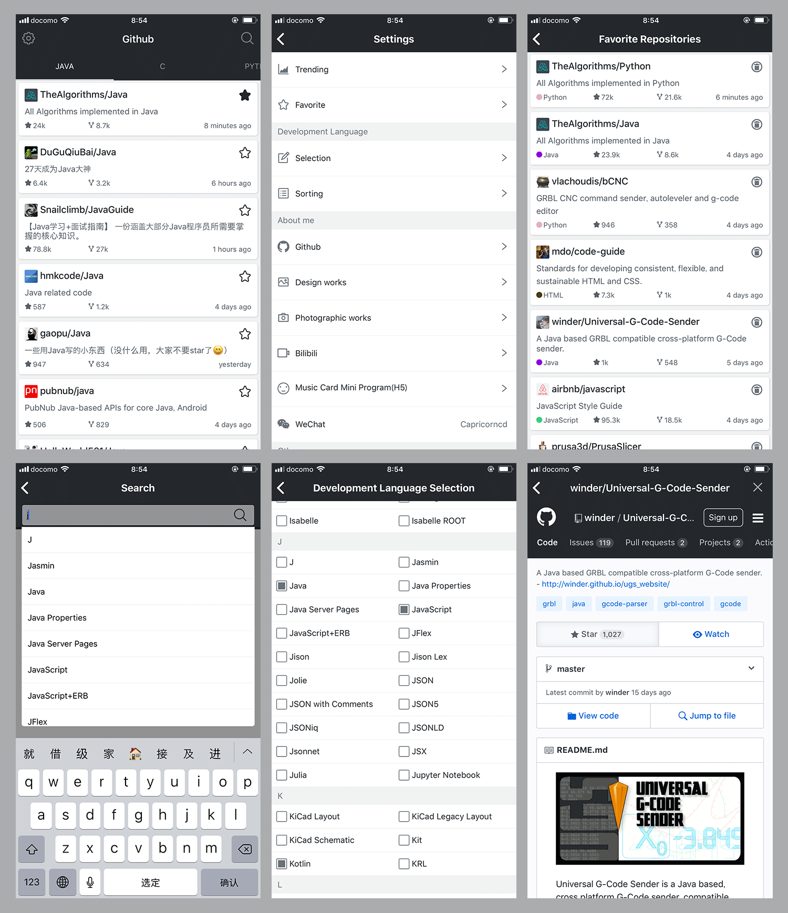

# GitHub App / GitHub 应用

[English](#english) | [中文](#chinese)

---

## English

### 📱 GitHub App

A React Native mobile application for browsing GitHub repositories, viewing user profiles, and managing GitHub-related activities on mobile devices.

### ✨ Features

- **Repository Browsing**: Browse and search GitHub repositories
- **User Profiles**: View GitHub user profiles and activities
- **Cross-platform**: Support for both iOS and Android
- **Modern UI**: Clean and intuitive user interface
- **Offline Support**: Basic offline functionality for cached content
- **Real-time Updates**: Live data from GitHub API

### 🚀 Quick Start

#### Prerequisites

- Node.js (v14 or higher)
- React Native CLI
- Xcode (for iOS development)
- Android Studio (for Android development)

#### Installation

1. **Install React Native CLI globally**
   ```bash
   npm install -g react-native-cli
   ```

2. **Clone the repository**
   ```bash
   git clone https://github.com/capricorncd/githubApp.git
   cd githubApp
   ```

3. **Install dependencies**
   ```bash
   npm install
   ```

4. **Run the application**

   **For iOS:**
   ```bash
   npm run ios
   ```

   **For Android:**
   ```bash
   npm run android
   ```

### 📱 App Download

Download the latest version from: [https://capricorncd.github.io/githubApp/download/index.html](https://capricorncd.github.io/githubApp/download/index.html)

### 📸 Screenshots

Screenshot from iPhone 6 Plus:



### 🛠️ Build Instructions

#### Building for iOS

1. **Bundle JavaScript files**
   ```bash
   npm run bundle-ios
   ```

2. **Open in Xcode**
   - Add `js bundle files` to the `GithubApp` project
   - Go to Xcode → Product → Scheme → Edit Scheme…
   - Set Build Configuration to "Release"
   - Build the project

#### Building for Android

```bash
cd android
./gradlew assembleRelease
```

### 🛠️ Development

#### Available Scripts

- `npm start` - Start the Metro bundler
- `npm run ios` - Run on iOS simulator
- `npm run android` - Run on Android emulator
- `npm test` - Run tests
- `npm run lint` - Run ESLint

#### Project Structure

```
src/
├── components/     # Reusable UI components
├── pages/         # Screen components
├── stores/        # Redux store configuration
├── utils/         # Utility functions
├── configs/       # Configuration files
└── App.js         # Main application component
```

### 📚 Dependencies

#### Core Dependencies
- **React Native**: ^0.80.0
- **React**: ^19.1.0
- **React Navigation**: ^7.1.14
- **React Redux**: ^9.2.0
- **Redux**: ^5.0.1

#### Key Libraries
- **React Native Vector Icons**: ^6.6.0
- **React Native WebView**: ^13.15.0
- **React Native Gesture Handler**: ^2.26.0
- **React Native Reanimated**: ^3.18.0

### 📖 Documentation

- [React Documentation](https://github.com/facebook/react)
- [React Native Documentation](https://reactnative.dev/)
- [React Navigation Documentation](https://reactnavigation.org/)
- [React Redux Documentation](https://react-redux.js.org/)
- [React Native WebView Documentation](https://github.com/react-native-community/react-native-webview)

### 🎨 Icons

- **Usage Guide**: [React Native Vector Icons](https://github.com/oblador/react-native-vector-icons)
- **Icon Browser**: [Vector Icons](https://oblador.github.io/react-native-vector-icons/)

### 🤝 Contributing

1. Fork the repository
2. Create your feature branch (`git checkout -b feature/AmazingFeature`)
3. Commit your changes (`git commit -m 'Add some AmazingFeature'`)
4. Push to the branch (`git push origin feature/AmazingFeature`)
5. Open a Pull Request

### 📄 License

This project is licensed under the MIT License.

---

## Chinese

### 📱 GitHub 应用

一个基于 React Native 开发的移动应用，用于在移动设备上浏览 GitHub 仓库、查看用户资料和管理 GitHub 相关活动。

### ✨ 功能特性

- **仓库浏览**: 浏览和搜索 GitHub 仓库
- **用户资料**: 查看 GitHub 用户资料和活动
- **跨平台支持**: 同时支持 iOS 和 Android
- **现代界面**: 简洁直观的用户界面
- **离线支持**: 缓存内容的基本离线功能
- **实时更新**: 从 GitHub API 获取实时数据

### 🚀 快速开始

#### 环境要求

- Node.js (v14 或更高版本)
- React Native CLI
- Xcode (用于 iOS 开发)
- Android Studio (用于 Android 开发)

#### 安装步骤

1. **全局安装 React Native CLI**
   ```bash
   npm install -g react-native-cli
   ```

2. **克隆仓库**
   ```bash
   git clone https://github.com/capricorncd/githubApp.git
   cd githubApp
   ```

3. **安装依赖**
   ```bash
   npm install
   ```

4. **运行应用**

   **iOS 平台:**
   ```bash
   npm run ios
   ```

   **Android 平台:**
   ```bash
   npm run android
   ```

### 📱 应用下载

从以下地址下载最新版本: [https://capricorncd.github.io/githubApp/download/index.html](https://capricorncd.github.io/githubApp/download/index.html)

### 📸 应用截图

iPhone 6 Plus 截图:


### 🛠️ 构建说明

#### iOS 构建

1. **打包 JavaScript 文件**
   ```bash
   npm run bundle-ios
   ```

2. **在 Xcode 中打开**
   - 将 `js bundle files` 添加到 `GithubApp` 项目
   - 进入 Xcode → Product → Scheme → Edit Scheme…
   - 将 Build Configuration 设置为 "Release"
   - 构建项目

#### Android 构建

```bash
cd android
./gradlew assembleRelease
```

### 🛠️ 开发

#### 可用脚本

- `npm start` - 启动 Metro 打包器
- `npm run ios` - 在 iOS 模拟器上运行
- `npm run android` - 在 Android 模拟器上运行
- `npm test` - 运行测试
- `npm run lint` - 运行 ESLint

#### 项目结构

```
src/
├── components/     # 可复用的 UI 组件
├── pages/         # 页面组件
├── stores/        # Redux 状态管理配置
├── utils/         # 工具函数
├── configs/       # 配置文件
└── App.js         # 主应用组件
```

### 📚 依赖库

#### 核心依赖
- **React Native**: ^0.80.0
- **React**: ^19.1.0
- **React Navigation**: ^7.1.14
- **React Redux**: ^9.2.0
- **Redux**: ^5.0.1

#### 主要库
- **React Native Vector Icons**: ^6.6.0
- **React Native WebView**: ^13.15.0
- **React Native Gesture Handler**: ^2.26.0
- **React Native Reanimated**: ^3.18.0

### 📖 文档

- [React 文档](https://github.com/facebook/react)
- [React Native 文档](https://reactnative.dev/)
- [React Navigation 文档](https://reactnavigation.org/)
- [React Redux 文档](https://react-redux.js.org/)
- [React Native WebView 文档](https://github.com/react-native-community/react-native-webview)

### 🎨 图标

- **使用指南**: [React Native Vector Icons](https://github.com/oblador/react-native-vector-icons)
- **图标浏览器**: [Vector Icons](https://oblador.github.io/react-native-vector-icons/)

### 🤝 贡献

1. Fork 本仓库
2. 创建功能分支 (`git checkout -b feature/AmazingFeature`)
3. 提交更改 (`git commit -m 'Add some AmazingFeature'`)
4. 推送到分支 (`git push origin feature/AmazingFeature`)
5. 创建 Pull Request

### 📄 许可证

本项目采用 MIT 许可证。

