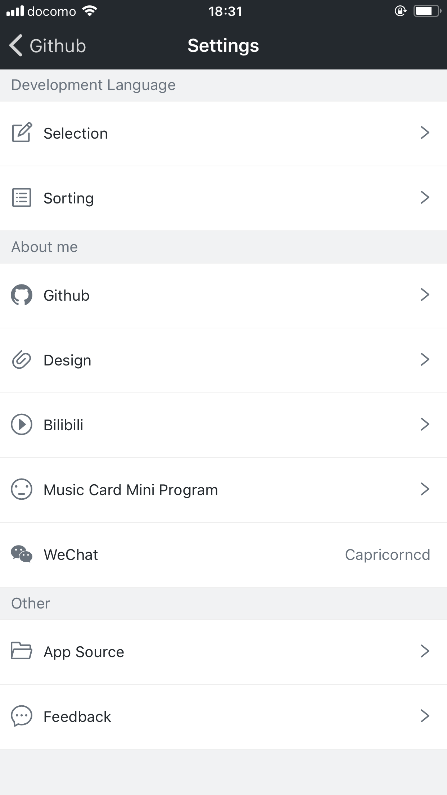
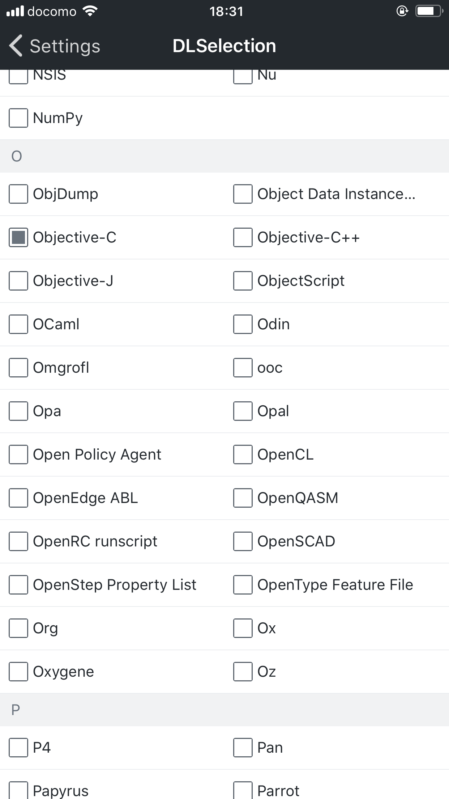
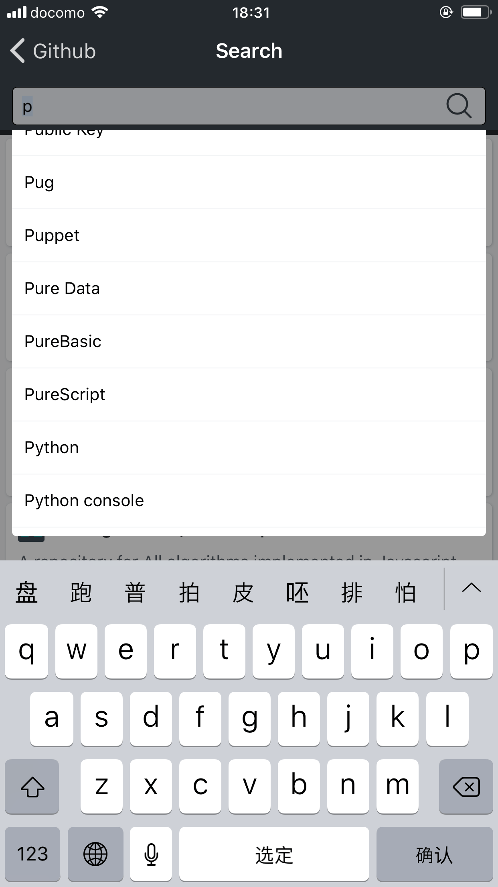

# GitHub App

GitHub App developed with React-Native

### App Download

https://capricorncd.github.io/githubApp/download/index.html

### Screenshot






### Start

```
npm i -g react-native-cli
```

```
npm i
```

```
npm run ios
# or
npm run android
```

### Documents

React Native https://reactnative.dev/

React Navigation https://reactnavigation.org/

React Redux https://react-redux.js.org/

WebView https://github.com/react-native-community/react-native-webview

### Icons

Usage https://github.com/oblador/react-native-vector-icons

Icons https://oblador.github.io/react-native-vector-icons/

